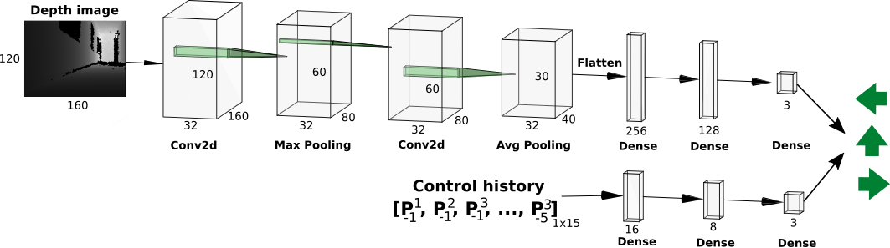
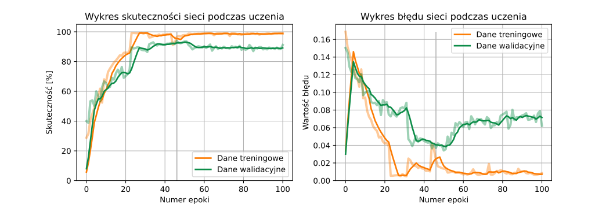
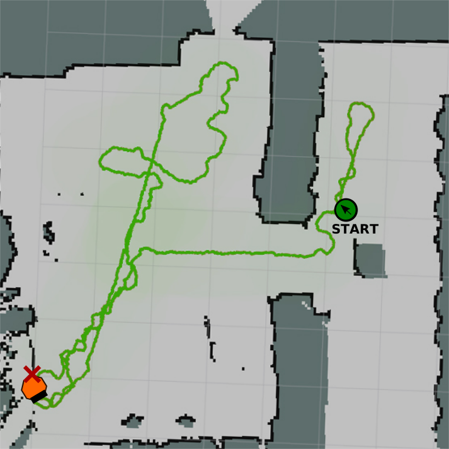
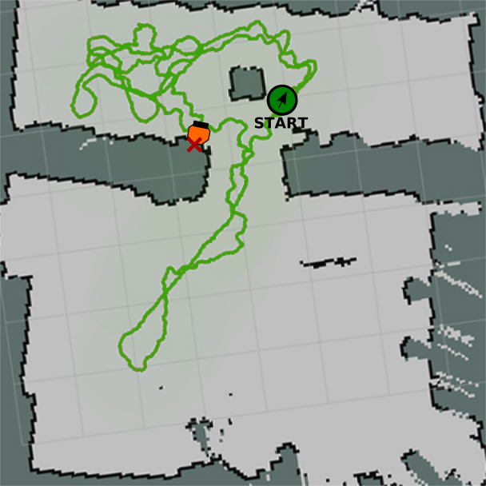

# Obstacle avoidance

This repository include obstacle avoidance system using CNN and decision-making process. This is the package for ROS system with trained neural networks and some helpful scripts.

## Obstacle avoidance network architecure

Proposed convolutional neural network architecture is presented below. As input there is an depth image with size 120x160 px and 5 last robot moves (vector of 15 elements with moves probability). As output it gives vector of 3 elements: probability of left move, forward move or right move. 

During training network gain 95% accuracy on test data and binary cross entropy loss equal to 0.0275. The training graphs are showed below.

During test, robot was in unknown environment and there are some graphs with his trajectories. In project labbot robot was used (robot similar to turtlebot) with Astra Orbecc RGB-D camera. To map environment and trajectories during test I used M1M1 Slamtec Mapper.

{ width=50% } { width=50% }

